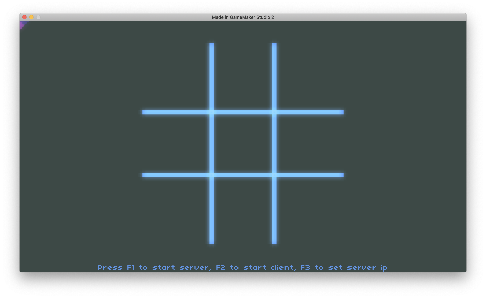
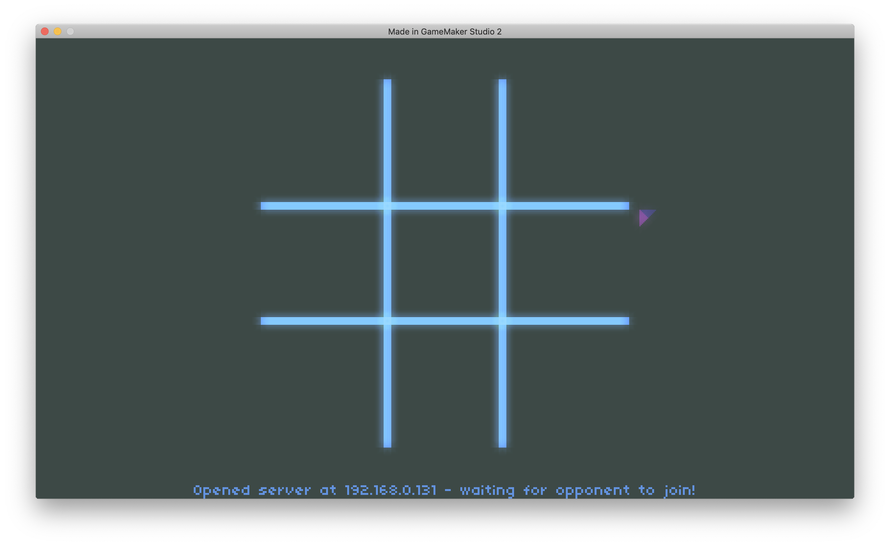

@net8floz 2018 

# tic-net-toe
A good starter project for getting into TCP networking in GameMaker Studio v2. Fully working Tic Tac Toe example.

Here are some screenshots: 

# Getting started (for development)
<ul>
<li>You will need to have two sessions running to run both sides of the game. Or, you can use another computer for testing. You can run more than one GMS2 IDE. (See the "File", "New IDE" option). NOTE: I'm not sure how GMS2 deals with more than one GMS2 editing the files at the same time.
<li>To see if anything is using a port (e.g. port 5000), use the `netstat` command.
	<ul>
		<li>From a mac terminal session, run: `netstat -ant | grep 5000`
		<li>From a windows pc command prompt, run: `netstat -an | findstr 5000`
	</ul>
<li>You may need to open up a port on your firewall to allow other computers to connect.
</ul>